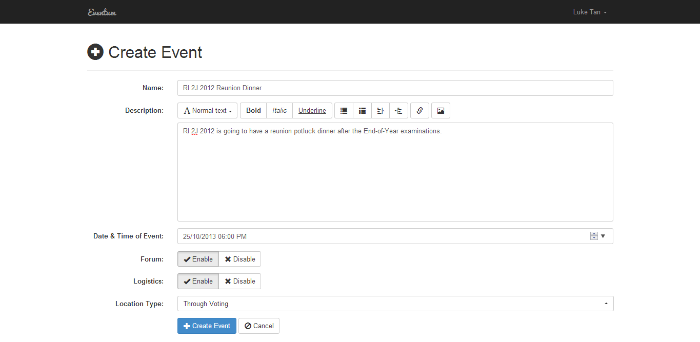
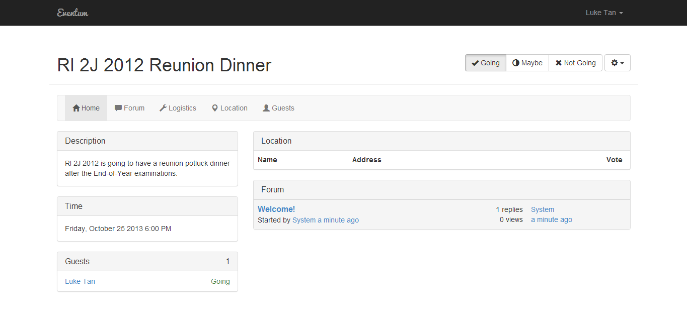
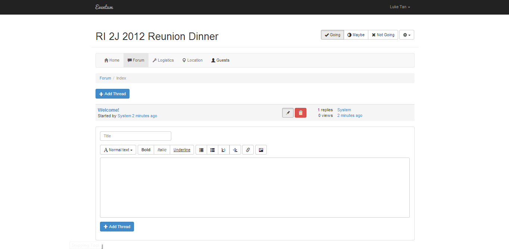
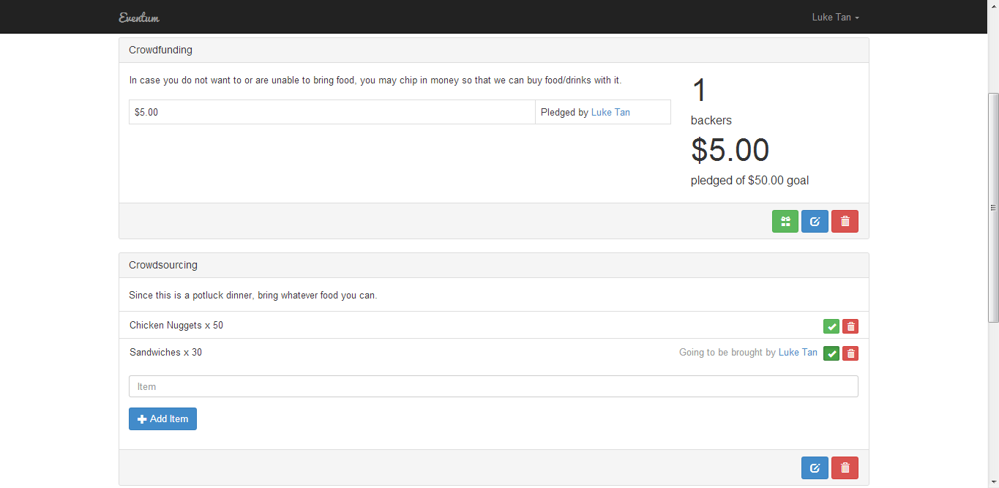
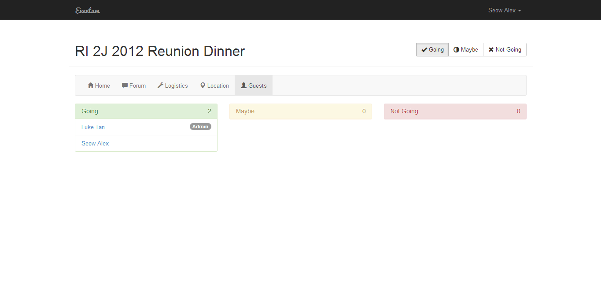

# Eventum

Eventum is an event organiser for small social gatherings with friends and colleagues. Built for the Google Cloud Developer Challenge 2013 using Python, Google App Engine, Google Maps API, Google+ API, Google Hangouts API and Bootstrap.

## Screenshots

